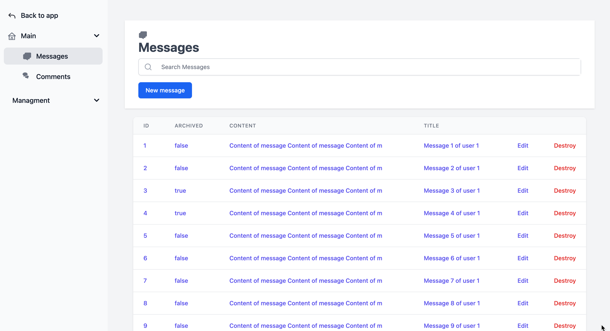

# administrate_tailwind_theme Gem
[](https://badge.fury.io/rb/administrate_tailwind_theme)
[](https://github.com/Eth3rnit3/administrate-tailwind-theme/actions/workflows/main.yml)
[](https://github.com/Eth3rnit3/administrate-tailwind-theme/actions/workflows/gem-push.yml)

## Introduction

`administrate_tailwind_theme` is a custom theme gem for the [Administrate](https://github.com/thoughtbot/administrate) gem, utilizing the [Tailwind CSS](https://tailwindcss.com/) framework. This gem revamps all views to use Tailwind CSS classes, enhancing the visual aesthetics and responsiveness of your Administrate dashboard. It also introduces additional fields like BooleanEmoji and CountryEmoji for a richer admin interface.

### Features
- **Tailwind CSS Integration:** Complete rewrite of Administrate component classes to use Tailwind CSS.
- **Additional Fields:** Adds BooleanEmoji and CountryEmoji fields to your Administrate dashboard.
- **Easy Setup:** Automatic initializer creation and configuration.
- **Rails 7, Rails-Tailwind, and Administrate Compatibility:** Seamlessly works with the latest versions of these key gems.

## Installation
### Prerequisites
- Ruby version 2.6.0 or higher.
- Rails 7.1 or higher.
- Administrate 0.15 or higher.
- Tailwind CSS Rails 2.0 or higher.

### Setup
1. Add this line to your application's Gemfile:

   ```ruby
   gem 'administrate_tailwind_theme'
   ```

2. Execute:

   ```
   bundle install
   ```

3. After installing the gem, run the installer:

   ```
   rails generate administrate_tailwind_theme:install
   ```

   This will create an initializer and modify your `tailwind.config.js` to ensure proper compilation of the gem's view styles.

## Usage

Once installed, `administrate_tailwind_theme` automatically overrides the default Administrate views. Your dashboard will now use Tailwind CSS styles. You can further customize the styles as per your application's needs.

### Themed views
Like [Administrate](https://github.com/thoughtbot/administrate) you can generate views to customize
```shell
./bin/rails g --help
...
AdministrateTailwindTheme:
   administrate_tailwind_theme:install
   administrate_tailwind_theme:view
   administrate_tailwind_theme:views
   administrate_tailwind_theme:views:edit
   administrate_tailwind_theme:views:field
   administrate_tailwind_theme:views:form
   administrate_tailwind_theme:views:index
   administrate_tailwind_theme:views:layout
   administrate_tailwind_theme:views:navigation
   administrate_tailwind_theme:views:new
   administrate_tailwind_theme:views:show
```

### Kaminari Themed pagination
[Administrate](https://github.com/thoughtbot/administrate) use [kaminari](https://github.com/kaminari/kaminari) to handle pagination. Related views are themed with tailwind too

```shell
./bin/rails g administrate_tailwind_theme:views:kaminari
```

### Navigations
#### Icons
For customizing the navigation menu with icons, you can include SVG files for each resource. Here's an example for adding an icon for `User` model:

```html
<!-- app/views/administrate/navigation/icons/_users.html.erb -->
<svg class="w-5 h-5 text-gray-500 transition duration-75 dark:text-gray-400 group-hover:text-gray-900 dark:group-hover:text-white" xmlns="http://www.w3.org/2000/svg" fill="currentColor" viewBox="0 0 20 20">
  <!-- SVG path for user icon -->
</svg>
```

Place this SVG file in the specified directory, and it will automatically be displayed next to the corresponding resource in the navigation menu.

### Custom Fields
#### BooleanEmoji Field
The `BooleanEmoji` field can be used to display boolean values with emojis for a more intuitive representation.

Example usage in a dashboard resource file:
```ruby
ATTRIBUTE_TYPES = {
  some_boolean_field: Field::BooleanEmoji,
  # ...
}.freeze
```

#### CountryEmoji Field
The `CountryEmoji` field is designed to display country codes with their corresponding emoji flags for a visual representation. It utilizes the iso_country_codes gem.

Example usage in a dashboard resource file:
```ruby
ATTRIBUTE_TYPES = {
  country_code: Field::CountryEmoji, # iso2
  # ...
}.freeze
```

## Configuration

After installation, you can modify the initializer created by the `administrate_tailwind_theme:install` generator to fine-tune the theme settings.

For modifying `tailwind.config.js`, we've followed the approach suggested in this [Stack Overflow comment](https://stackoverflow.com/a/74737193/8213274). Even though it might not be the most elegant solution, it's straightforward and works effectively.

Also, ensure your `tailwind.config.js` includes the styles from this gem for proper compilation.

## Contributing

Contributions are welcome! Please feel free to submit pull requests or open issues on our [GitHub repository](https://github.com/eth3rnit3/administrate_tailwind_theme).

## License

This gem is available as open source under the terms of the [MIT License](https://opensource.org/licenses/MIT).

## About

This gem is maintained by Eth3rnit3. Feel free to contact at [eth3rnit3@gmail.com](mailto:eth3rnit3@gmail.com) for any queries or feedback.